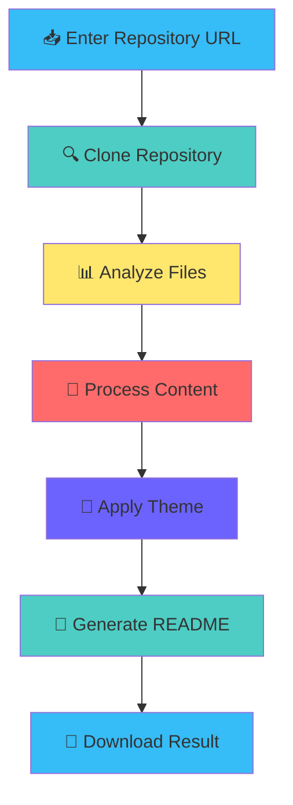

<div align="center">

# 🚀 GitHub Repository Documentation Generator

<p align="center">
  
</p>


<p align="center">
  
</p>

</div>

---

<div align="center">

## 📖 About This Project


</div>

Transform any GitHub repository into stunning, professional documentation with our advanced web application. Built with modern technologies and designed for developers who care about presentation, this tool analyzes entire codebases and generates comprehensive README files that showcase your projects beautifully.

<div align="center">
  
</div>

---

<div align="center">

## ✨ Key Features


</div>

<div align="center">

| Feature Category | Description |
|:---:|:---:|
| 🎨 **Design** | Six stunning color themes with animated elements |
| ⚡ **Performance** | Lightning-fast analysis and generation |
| 🔒 **Security** | Secure handling of repositories and credentials |
| 🛠️ **Maintenance** | Clean, modular architecture for easy updates |

</div>

### 🎨 **Visual Excellence**
- **Animated Typing Headers** - Dynamic text animations that captivate visitors
- **Professional Color Themes** - Six carefully crafted color schemes for every style
- **Rich Markdown Formatting** - Tables, badges, collapsible sections, and more
- **GIF Animations** - Eye-catching visual elements throughout documentation

### 🔧 **Advanced Analysis**
- **Complete Codebase Processing** - Downloads and analyzes entire repositories
- **Multi-Language Support** - Supports 25+ programming languages and frameworks
- **Smart File Detection** - Automatically identifies and categorizes project files
- **Dependency Analysis** - Extracts and documents project dependencies

### 🌈 **Customization Options**
- **🌊 Ocean Blue** - Professional and clean aesthetic
- **🌅 Sunset Orange** - Warm and inviting color palette
- **🌲 Forest Green** - Natural and calming tones
- **💜 Royal Purple** - Elegant and sophisticated styling
- **🔮 Cyberpunk Neon** - Futuristic electric colors
- **⚫ Minimal Dark** - Sleek and modern dark theme

### 🚀 **Developer Experience**
- **Intuitive Interface** - User-friendly web application
- **Real-time Progress** - Live updates during generation process
- **One-Click Download** - Instant README.md file download
- **Error Handling** - Robust fallback mechanisms

---

<div align="center">

## 🛠️ Technology Stack


</div>

<details>
<summary>📊 <strong>Technology Breakdown</strong></summary>

- **Python** - Core application logic and processing
- **Streamlit** - Interactive web application framework
- **GitPython** - Git repository operations and cloning
- **Requests** - HTTP requests for repository downloads
- **PathLib** - Modern file system operations
- **TempFile** - Secure temporary file management

</details>

---

<div align="center">

## 🚀 Getting Started


</div>

<details>
<summary>📦 <strong>Prerequisites</strong></summary>

- 
- 
- Modern web browser (Chrome, Firefox, Safari, Edge)
- Internet connection for repository access

</details>

### 🔥 Quick Start

```bash
# 1️⃣ Clone the repository
git clone https://github.com/username/github-readme-generator.git
cd github-readme-generator

# 2️⃣ Install dependencies
pip install -r requirements.txt

# 3️⃣ Start the application
streamlit run app.py

# 4️⃣ Open your browser
# Navigate to http://localhost:8501
```

### 🌐 Deploy to Render

```bash
# 1️⃣ Fork this repository
# 2️⃣ Connect to Render
# 3️⃣ Create new Web Service
# 4️⃣ Use render.yaml configuration
# 5️⃣ Add GEMINI_API_KEY environment variable
```

<div align="center">

### 🎯 Ready to Generate! 


</div>

---

<div align="center">

## 📁 Project Structure


</div>

| File/Directory | Purpose |
|---|---|
| `app.py` | Main Streamlit application and user interface |
| `agents/` | Modular processing components |
| `├── repo_manager.py` | Repository downloading and file scanning |
| `├── code_analyzer.py` | File analysis and metadata extraction |
| `├── readme_generator.py` | README generation with themes |
| `├── doc_aggregator.py` | Documentation compilation |
| `utils/` | Utility functions and validators |
| `├── validators.py` | Input validation and URL checking |
| `.streamlit/` | Streamlit configuration files |
| `render.yaml` | Render deployment configuration |
| `requirements.txt` | Python dependencies |

<div align="center">
  
</div>

---

<div align="center">

## 🎮 How It Works


</div>

<div align="center">



</div>

### 🔄 Process Flow

1. **Repository Input** - Enter any public GitHub repository URL
2. **Smart Cloning** - Automatic download with fallback mechanisms
3. **File Analysis** - Comprehensive scanning of all project files
4. **Content Processing** - Intelligent extraction of project information
5. **Theme Application** - Apply your chosen color scheme and styling
6. **README Generation** - Create professional documentation
7. **Instant Download** - Get your README.md file immediately

---

<div align="center">

## 🎨 Theme Gallery


</div>

<div align="center">

| Theme | Preview | Description |
|:---:|:---:|:---:|
| 🌊 **Ocean Blue** |  | Professional and trustworthy |
| 🌅 **Sunset Orange** |  | Warm and creative |
| 🌲 **Forest Green** |  | Natural and calming |
| 💜 **Royal Purple** |  | Elegant and sophisticated |
| 🔮 **Cyberpunk Neon** |  | Futuristic and bold |
| ⚫ **Minimal Dark** |  | Clean and modern |

</div>

---

<div align="center">

## 🌟 Examples


</div>

### 📸 Before & After

<details>
<summary>🔍 <strong>View Transformation Examples</strong></summary>

**Before:** Basic repository with minimal documentation
```
# MyProject
A simple web application.

## Installation
npm install
npm start
```

**After:** Professional, engaging documentation
- Animated headers with typing effects
- Color-coordinated badges and shields
- Comprehensive feature lists
- Professional setup instructions
- Technology stack visualization
- Contributing guidelines

</details>

---

<div align="center">

## 🤝 Contributing


We welcome contributions from developers of all skill levels!

</div>

<details>
<summary>🛠️ <strong>How to Contribute</strong></summary>

### 🚀 Getting Started
1. **Fork** the repository
2. **Clone** your fork locally
3. **Create** a feature branch (`git checkout -b feature/amazing-feature`)
4. **Make** your changes
5. **Test** thoroughly
6. **Commit** your changes (`git commit -m 'Add amazing feature'`)
7. **Push** to the branch (`git push origin feature/amazing-feature`)
8. **Open** a Pull Request

### 🎯 Contribution Areas
- 🎨 New color themes and visual improvements
- 🔧 Additional file type support
- 🌐 Internationalization and localization
- 📚 Documentation improvements
- 🐛 Bug fixes and performance optimizations
- ✨ New features and enhancements

### 📝 Guidelines
- Follow PEP 8 style guidelines for Python code
- Write clear commit messages
- Add tests for new features
- Update documentation as needed
- Be respectful and constructive in discussions

</details>

---

<div align="center">

## 📄 License

This project is licensed under the **MIT License** - see the [LICENSE](LICENSE) file for details.

## 🌟 Support the Project


If this tool helped you create better documentation, please give it a ⭐️!

### 💝 Ways to Support
- ⭐ Star this repository
- 🍴 Fork and contribute
- 🐛 Report issues and bugs
- 💡 Suggest new features
- 📢 Share with the community

---


**Made with ❤️ by developers, for developers**


</div>

---

<div align="center">

### 🚀 Ready to Transform Your Documentation?

[**Get Started Now**](https://your-app-url.render.com) • [**Report Bug**](https://github.com/username/repo/issues) • [**Request Feature**](https://github.com/username/repo/issues)


</div>
